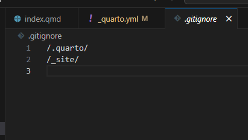
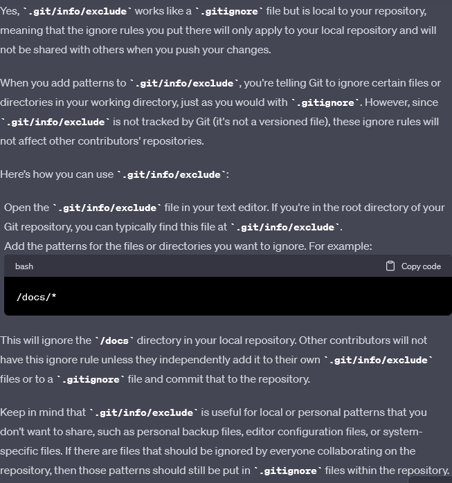
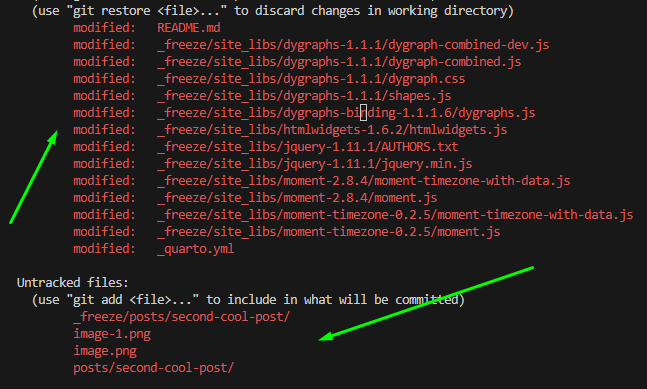
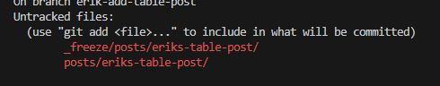
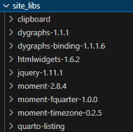

# New R Consortium Website

This is a new Quarto-based website which updates and supersedes the original website [here:](https://www.r-consortium.org/)

R Consortium Blog - [How to upload your blog post to a quarto-based website](https://oppkeyquarto.netlify.app/blog/how_to_post.html)

## Contributing to this website

This website is being built members of the R Consortium, R-Ladies Gaborone and other volunteer contributors. Thank you! If you want to help contribute to the site, please use the following workflow.

### Workflow for making contributions

#### 1\. Clone this website

#### 2\. Make a branch

Make a branch and edit your branch locally.

To preview the website locally you can execute this quarto command in your terminal:

#### 3\. Commit your changes

Make your changes locally save them and commit them. Be sure to make your commit message descriptive of the work you did.

#### 4\. Do a Pull Request

Do a pull request from your local copy to make sure branch is in sync with the website branch. We will review your Pull Request!

## What is the R Consortium?

The R Consortium, Inc. is a group organized under an open source governance and foundation model to support the worldwide community of users, maintainers and developers of R software. Its [members](https://oppkeyquarto.netlify.app/members) include leading institutions and companies dedicated to the use, development and growth of R.

The R language is an open source environment for statistical computing and graphics. The R community has enjoyed significant growth, with more than 2 million users worldwide. A broad range of organizations have adopted the R language as a data science platform, including biotech, finance, research and high technology industries. The R language is often integrated into third-party analysis, visualization and reporting applications, and runs on a wide variety of computing platforms.

The R Consortium’s mission is to promote the R language and to develop the technical and social infrastructure required to support the R ecosystem and the R Community. Its activities and programs include:

Promoting the growth and development of R as a leading platform for data science and statistical computing.  
[Members of the R Consortium](https://oppkeyquarto.netlify.app/members) are recognized as supporters of the R Project and the R community, and the R Consortium represents its members to the R community and to the media.  
Supporting and collaborating with the [R Foundation](https://www.r-project.org/foundation/), the governing body of the R Project.

The R Foundation maintains a permanent seat on the board of the R Consortium, as an open communication channel for R Consortium members.

Funding projects to enhance R and support its users.

Projects are proposed by the R community at large, and selected for funding by the Infrastructure Steering Committee. R Consortium members nominate the selection committee and provide funds for project grants with their membership dues. (Here is a list of [projects funded by the R Consortium](https://oppkeyquarto.netlify.app/all-projects/funded-projects) to date.)

Fostering the continued growth of R community and the data science ecosystem.

The R Consortium sponsors R-related conferences (including useR!), meetings (including SatRDays and RLadies), and local user groups worldwide.

Enabling the use of R in commercial environments, and fostering collaboration between companies investing in R.  
R Consortium committees are developing programs for R language certification and training, consulting, and employment.

The mission of the R Consortium is formally defined in the [R Consortium bylaws](rc-docs/Bylaws-GU-Draft-7-9-2024.docx.pdf) (PDF) and the [Infrastructure Steering Committee charter](rc-docs/ISC-Charter-08-11-23.pdf) (PDF).

## Main Links

Main Site: [https://www.r-consortium.org/](https://www.r-consortium.org/)  
News: [https://www.r-consortium.org/news](https://www.r-consortium.org/news)  
Blog: [https://www.r-consortium.org/news/blog](https://www.r-consortium.org/news/blog)  
Join: [https://www.r-consortium.org/about/join](https://www.r-consortium.org/about/join)  
Twitter: [https://twitter.com/rconsortium?lang=en](https://twitter.com/rconsortium?lang=en)  
LinkedIn: [https://www.linkedin.com/company/r-consortium/](https://www.linkedin.com/company/r-consortium/)  
Mastodon: [https://fosstodon.org/@RConsortium](https://fosstodon.org/@RConsortium)

---

## Development Section

## Quarto Project hosted with Netlify

## Live site here: [https://oppkeyquarto.netlify.app/](https://oppkeyquarto.netlify.app/)

## Running locally

Clone repo

Use `quarto preview` to run locally. Ensure you are in the root directory of the Quarto project where the _quarto.yml file is located.

If you use `quarto serve` you may get the error:

ERROR: No input passed to serve.
If you are attempting to preview a website or book use the quarto preview command instead.

## Setup for Contributors

Install R using sudo apt-get install r-base and sudo apt-get install r-base-dev

Install R packages on Linux; type R in console and then install.packages('rmarkdown')

GGPLOT2 installation: install.packages("ggplot2")

dygraphs installation : install.packages("dygraphs")

## Project Setup

The .gitignore of this project is setup to ignore `_site/` and `.quarto/`

- `_site/` is also known as `docs/` in other quarto projects

- `_site` was specified as netlify publish directory on the website 

## Notable findings

- Only the freeze directory is needed when hosting on netlify using the [plugin](https://github.com/quarto-dev/netlify-plugin-quarto)

- Can use the "local only" ignoring files strategy. Each person adds `_freeze/` to the exclude file and only have one person who is reponsible for rendering and uploading to netlify

- When adding a new post these are the files that are added and the ones that are modified, I *manually* modified README.md and _quarto.yml

- Second time after initial setup these are the files that need to be added, my observation from this is that it's possible that only during initial setup  merge conflicts are a problem due to `site_libs/` directory. I think `site_libs/` is modified only when someone sets up quarto. I can try git_ignoring that directory and see if it causes a build failure or not on netlify. Maybe when someone is setting up R and the libraries on their computer it downloads and modifies this directory.

